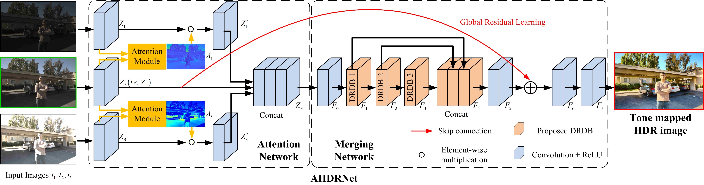
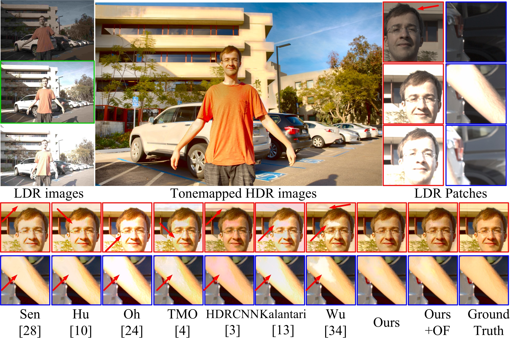
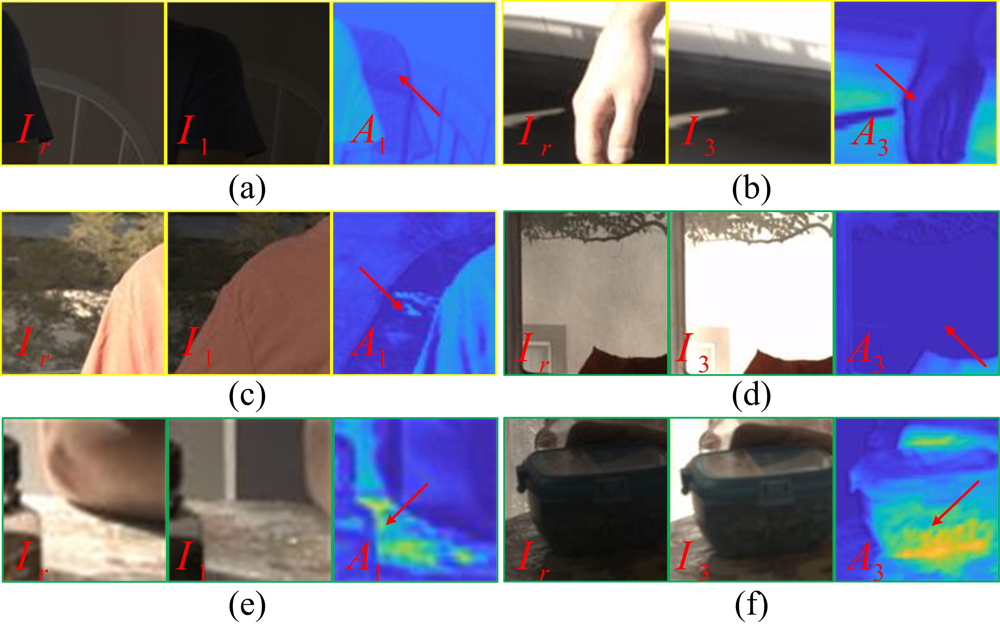

# AHDRNet
<small> Attention-guided Network for Ghost-free High Dynamic Range Imaging (AHDR)

Qingsen Yan*, Dong Gong*, Qinfeng Shi, Anton van den Hengel, Chunhua Shen, Ian Reid, Yanning Zhang. 
In IEEE Conference on Compute rVision and Pattern Recognition (CVPR), 2019:1751-1760. (\* Equall contribution)
\[[Paper](http://openaccess.thecvf.com/content_CVPR_2019/papers/Yan_Attention-Guided_Network_for_Ghost-Free_High_Dynamic_Range_Imaging_CVPR_2019_paper.pdf)\]\[[Project](https://donggong1.github.io/ahdr.html)\]

  


## Requirements
+ Python 2.7
+ PyTorch 0.3.1 (tested with 0.3.1)
+ MATLAB (for data preparation)


## Usage
### Testing
1. Install this repository and the required packages. A pretrained model is in `./trained-model`.
2. Prepare dataset.
   1) Download dataset.
   2) Move the dataset into `./dataset`. 
   3) Processed dataset can be obtained by running the corresponding script in `./matlab_script (To be added)`.
3. Run `python script_testing.py` files. 

### Training
Training code will be released later. 

### Examples of the Results
 

### Examples of the Estimated Attention Maps
 


## Citation
If you use this code for your research, please cite our paper.

```
@article{yan2019attention,
  title={Attention-guided Network for Ghost-free High Dynamic Range Imaging},
  author={Yan, Qingsen and Gong, Dong and Shi, Qinfeng and Hengel, Anton van den and Shen, Chunhua and Reid, Ian and Zhang, Yanning},
  journal={IEEE Conference on Compute rVision and Pattern Recognition (CVPR)},
  year={2019}
  pages={1751-1760}
}
```


